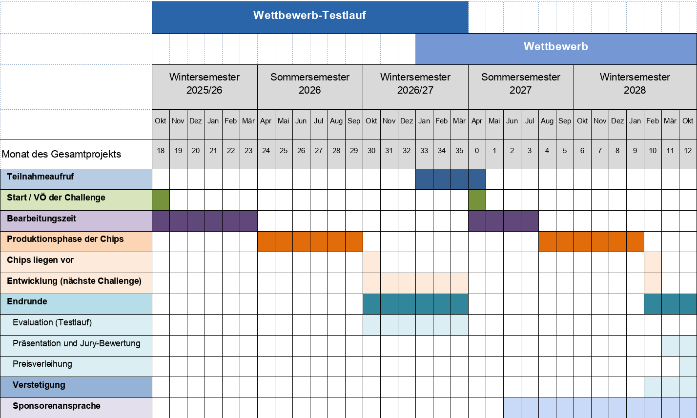

# Wettbewerbskonzept für einen Chip-Design Wettbewerb für Studierende

*Erstellt im Rahmen des Förderprojektes „Open Chip Design Challenge Prototype“ (DI-OCDCPro)*

## Inhaltsverzeichnis
[**1. Vorbemerkung**](#1-vorbemerkung)
> [1.1. Wettbewerbsziele](#11-wettbewerbsziele)
>
> [1.2. Wettbewerbszielgruppen](#12-wettbewerbszielgruppen)

[**2. Kurzzusammenfassung der Marktanalyse**](#2-kurzzusammenfassung-der-marktanalyse)

>[2.1. Zusammenfassung](#21-zusammenfassung)
>
>[2.2. Implementierung der Ergebnisse in das Wettbewerbskonzept](#22-implementierung-der-ergebnisse-in-das-wettbewerbskonzept)

[**3. Wettbewerbsumsetzung**](#3-wettbewerbsumsetzung)

> [3.1. Wettbewerbssystematik](#31-wettbewerbssystematik)
>
> [3.2. Definition der Teilnahmebedingungen](#32-definition-der-teilnahmebedingungen)
>
> [3.3. Zusammensetzung der Jury](#33-zusammensetzung-der-jury)
>
> [3.4. Aufgabenerstellung](#34-aufgabenerstellung)
>
> [3.5. Aufgabenveröffentlichung und Ansprache von Teilnehmenden](#35-aufgabenveröffentlichung-und-ansprache-von-teilnehmenden)
>
> [3.6. Bewertungssystematik und -kriterien](#36-bewertungssystematik-und--kriterien)
>
> [3.7. Abschlussveranstaltung zur Ehrung der Preisträger*innen](#37-abschlussveranstaltung-zur-ehrung-der-preistragerinnen)
>
> [3.8. Wettbewerbszyklen](#38-wettbewerbszyklen)
>
> [3.9. Anreizstruktur](#39-anreizstruktur)

[**4. Kommunikation**](#4-kommunikation)
> [4.1. Studierenden-Ansprache](#41-studierenden-ansprache)
>
>[4.2. Lehrenden-Ansprache (Hochschulen)](#42-lehrenden-ansprache-hochschulen)

## 1. Vorbemerkung 

Der Chip-Design-Wettbewerb „Open Chip Design Challenge Prototype“ (DI-OCDCPro) will Studierende für das zukunftsweisende Feld des Mikrochip-Designs begeistern und praxisnah an grundlegende Konzepte ebenso wie aktuelle Herausforderungen der Branche heranzuführen. Ein konsequenter Open-Source-Ansatz, interdisziplinäre Zusammenarbeit und eine starke kreative Ausrichtung haben dabei einen besonderen Stellenwert.

Der Wettbewerb stellt sich der anspruchsvollen Aufgabe, sowohl eine breite Zielgruppe von Studierenden anzusprechen als auch herausragende Exzellenz im Chip-Design zu fördern. Um dies zu erreichen, ist die Aufgabenstruktur bewusst mehrstufig aufgebaut: Eine Basiskomponente ermöglicht den Einstieg für alle Teilnehmenden, während aufeinander aufbauende Spezialisierungen gezielt anspruchsvolle Herausforderungen für fortgeschrittene Teams bieten. Dadurch können Studierende mit unterschiedlichem Vorwissen teilnehmen und sich entlang ihres individuellen Kompetenzniveaus weiterentwickeln. Während niedrigere Level grundlegende Prinzipien der Mikroelektronik und Open-Source-EDA-Tools vermitteln, beinhalten höhere Level fortgeschrittene Sicherheits- und Optimierungsanforderungen. Dieser Ansatz gewährleistet einerseits eine breite Beteiligung aus verschiedenen Disziplinen und Hochschulen, andererseits schafft er Anreize für leistungsstarke Teams, innovative und komplexe Lösungen zu erarbeiten, die technologische Exzellenz sichtbar machen.

Der Wettbewerb legt besonderen Wert auf Kreativität und Teamgeist, anstatt reinen Leistungsvergleich zu fördern. Die Teilnehmenden arbeiten in interdisziplinären Teams zusammen, um innovative Chip-Designs zu entwickeln und voneinander zu lernen – auch Teamübergreifend. Durch offene Austauschformate und gemeinsames Mentoring entsteht eine Lernumgebung, die den kreativen Prozess stärkt. So wird der Wettbewerb zu einer Plattform für gemeinsames Wachstum und nicht nur zu einem reinen Wettstreit.

## 1.1. Wettbewerbsziele

Das zentrale Ziel des Wettbewerbs liegt darin, nachhaltig qualifizierte Nachwuchskräfte für das Mikrochipdesign zu gewinnen und deren berufliche Entwicklung so zu unterstützen, dass langfristig ein stabiler Pool an Fachkräften entsteht, der die technologische Zukunftsfähigkeit und Souveränität Deutschlands und Europas befördert.

### Kurzfristige Ziele

Im Vordergrund steht, bei Studierenden das Bewusstsein für Karrieremöglichkeiten im Chip-Design zu stärken und praxisnah grundlegendes Fachwissen aufzubauen.

**Erfolgsmessung:** Der Erfolg lässt sich an der Anzahl angemeldeter Teams, am erfolgreichen Abschluss der Projekte und am positiven Feedback zur fachlichen Relevanz messen.

### Mittelfristige Ziele

Auf mittlere Sicht will der Wettbewerb weitere Studierende für das Berufsfeld Chip-Design gewinnen, Talente fördern und den Nachwuchs für Forschung und Industrie sichern. Ein besonderes Augenmerk liegt dabei auf der Steigerung der Diversität in der Chip-Design Community. Gleichzeitig wird eine stärkere Nutzung und Verbreitung der Open-Source-Softwaretools des projekteigenen Prozess Design Kits (PDK) angestrebt.

**Erfolgsmessung:** Wachsende Teilnehmerzahlen aus unterschiedlichsten Hochschulen und Disziplinen sowie an der verstärkten Verbreitung und Nutzung des PDKs und der darin enthaltenen Open Source Tools..

### Langfristige Ziele

Langfristig wird ein starkes, diverses und dynamisches Chip-Design-Ökosystem angestrebt, das die technologische Souveränität Deutschlands erhöht, Innovationskraft und Unabhängigkeit stärkt und sich durch stabile Netzwerke, anhaltende Forschungsaktivitäten, frei zugängliche Ressourcen sowie die zunehmende Integration von Chip-Design-Kompetenzen in Wissenschaft, Wirtschaft und Lehre auszeichnet.

## 1.2. Wettbewerbszielgruppen

Ziel ist es, einen fachbezogenen Breitenwettbewerb zu etablieren, der möglichst viele Studierende aus technischen Studiengängen anspricht, um so die in den Wettbewerbszielen beschriebenen Vorhaben zu unterstützen. Im Vordergrund stehen hierbei vor allem Disziplinen wie Informatik, Elektrotechnik, Informationstechnik, Mikroelektronik oder vergleichbare ingenieurwissenschaftliche Fachrichtungen, in denen das Chip-Design eine relevante Rolle spielt.

*Abbildung 1: Zielgruppendarstellung*

Diese Fachbereiche bilden den Kern der Zielgruppen. Studierende dieser Disziplinen sollen im Wettbewerb zusammenfinden, um gemeinsam an Chip-Design-Projekten zu arbeiten.

Da diese Fachbereiche häufig noch wenig divers aufgestellt sind, legt der Wettbewerb großen Wert darauf, Studierende mit unterschiedlichen Hintergründen und Erfahrungen zu erreichen. Eine vielfältige Zusammensetzung der Teilnehmenden aus verschiedenen Semestern, Fachrichtungen und persönlichen Profilen fördert einen intensiven Wissens- und Ideenaustausch. Dadurch entstehen interdisziplinäre Teams, die ein breiteres Spektrum an Herangehensweisen an das Chip-Design einbringen und so zu innovativen Lösungen gelangen. Gleichzeitig kann dieses offene Umfeld dazu beitragen, neue Perspektiven auf das Berufsfeld zu eröffnen und langfristig mehr Studierende für eine Karriere im Chip-Design zu begeistern.

## 2. Kurzzusammenfassung der Marktanalyse

Die Marktanalyse untersuchte internationale und nationale Wettbewerbsformate im Bereich Chip-Design mit besonderem Fokus auf Open-Source-Technologien (siehe Anlage 1: “Marktanalyse”). Für den deutschen sowie europäischen Markt wurde ein Defizit solcher Wettbewerbe festgestellt, was eine bedeutende Chance zur Einführung eines Open-Source-Chipdesign-Wettbewerbs in Deutschland bietet. Wichtige Erkenntnisse zu den analysierten Wettbewerben sind folgende:

- **Teilnehmendengruppen**: Erfolgreiche Wettbewerbe sprechen eine breite Zielgruppe an, darunter Bachelor- und Masterstudierende sowie internationale Teilnehmende. Formate wie der IEEE SSCS Code-a-Chip zeichnen sich außerdem durch interdisziplinäre Teams aus.

- **Technologien**: Moderne Open-Source-Tools (z. B. OpenLane, Verilog, SKY130) dominieren in erfolgreichen Wettbewerben wie der Efabless Challenge und erhöhen die Attraktivität bei Studierenden.
- **Anreize**: Hohe Preisgelder (bis zu 5.000 €), kostenfreie Chip-Fertigungen im Gegenwert von bis zu 9.000 € , Industriepraktika sowie Reisestipendien zu internationalen Konferenzen stellen für Studierende starke Motivationsfaktoren dar.
- **Industriepartnerschaften**: Wettbewerbe mit starken Verbindungen zur Industrie (z. B. X-FAB Design Contest) profitieren von erhöhter Sichtbarkeit und Ressourcenzugang.

Die Analyse identifizierte folgende Erfolgsfaktoren:

- **Zielgruppe**: Eine breite Ansprache und ein weiter Zielgruppenfokus.
- **Tools**: Möglichst niedrigschwellige Nutzung innovativer Technologien wie Open-Source-EDA-Tools.
- **Incentives**:
  - Attraktive Preise und Karriereanreize.
  - Einbindung von Industriepartnern und akademischen Institutionen.
  - Bereitstellung eines attraktiven Netzwerkes zur Unterstützung in fachlichen Belangen und zum Austausch in einer Community auf Augenhöhe.

## 2.1. Zusammenfassung

Deutschland ist durch eine starke Hochschullandschaft und Open-Source Community und ein wachsendes wirtschaftliches, politisches und öffentliches Interesse an Chip-Design und -Produktion gekennzeichnet. Daraus ergeben sich große Potentiale. Gleichzeitig müssen für eine erfolgreiche Wettbewerbsdurchführung und eine nachhaltige Etablierung signifikante Herausforderungen überwunden werden.

| Risiken und Herausforderungen | Lösungsansätze |
| --- | --- |
| **1. Konkurrenz durch etablierte internationale Wettbewerbe** Bereits bestehende, teils hochdotierte Wettbewerbe ziehen potenzielle Teilnehmende ab. | - Enge Einbindung von Multiplikator*innen (Lehrpersonal an Hochschulen, Hochschulnetzwerke) und umfangreiche Öffentlichkeitsarbeit, um Sichtbarkeit und Attraktivität zu steigern. - Betonung von Alleinstellungsmerkmalen, insb. Open-Source PDK und Möglichkeit der Chip-Fertigung. |
| **2. Bedarf an langfristiger Finanzierung und Infrastruktur** Für die kontinuierliche Durchführung sind langfristige Ressourcen erforderlich. | - Systematische Einbindung von Unternehmen und öffentlichen Fördermitteln zur finanziellen und infrastrukturellen Absicherung. - Aufbau eines Konsortiums (Hochschulen, Verbände, Industrie), das über mehrere Jahre die Finanzierung sicherstellen kann. |
| **3. Dissemination des Wettbewerbs in einer komplexen und weitreichenden Hochschullandschaft** Herausforderung, möglichst viele Studierende zu erreichen. | - Breite Zielgruppenansprache über Fachbereiche hinaus (Informatik, Elektrotechnik, etc.). - Empowerment von Multiplikator*innen: Lehrenden-Workshops, Kommunikationstools und -Kits bereitstellen. - Regionale Netzwerke aktivieren: Zusammenarbeit mit Fachgruppen, studentischen Initiativen und Verbänden. |
| **5. Hohe Eintrittshürden durch die Komplexität der zu verwendenden Tools** Open-Source-EDA-Tools erfordern spezielle Kenntnisse. | - Niedrigschwellige Einstiegsmöglichkeiten: Bereitstellung von verständlichen Tutorials/Videoanleitungen. - Mentoring und Workshops: Erfahrene Expert*innen (aus Hochschulen oder Industrie) begleiten Teams und beantworten technische Fragen. - Modularer Wettbewerbsaufbau: Mehrstufiges Level-System (Basisaufgabe bis Level 3), um dem unterschiedlichen Kenntnisstand gerecht zu werden. |
| **6. Hoher Zeitdruck/Workload bei Studierenden** Neben dem Studium bleibt oft wenig Spielraum für zusätzliche Projekte. | - Anrechnung der Teilnahme als Studienleistung (ECTS). - Ausreichend Bearbeitungszeit, um Klausurenphasen etc. zu berücksichtigen. |
| **7. Gefahr von „homophilem Lock-in“ durch geringe Diversität der Chip-Design-Community / Reproduktion von Exklusion** | - Geschlechtersensible Sprache, Sichtbarmachung unterschiedlicher Vorbilder und Erfolgsgeschichten. - Teambildung fördern. - Aktive Ansprache unterrepräsentierter Gruppen. |

Tabelle 1: Übersicht Risiken/Herausforderungen und Lösungsansätze

## 2.2. Implementierung der Ergebnisse in das Wettbewerbskonzept

Auf Basis der Marktanalyse wurden zentrale Erkenntnisse in die Gestaltung des Wettbewerbs integriert. Diese betreffen insbesondere die technologische Ausrichtung, den strukturellen Ablauf, die Anreize für die Teilnehmenden, die Einbindung von Partnern sowie die Transparenz und Veröffentlichung der Ergebnisse.

- **Technologische Ausrichtung**  
  Der Wettbewerb setzt konsequent auf Open-Source-Technologien, um den Zugang für alle Teilnehmenden zu erleichtern und moderne Entwicklungspraktiken zu fördern. Konkret bedeutet das: 
  - Verwendung von Open-Source-EDA-Tools wie **OpenLane** und **Verilog**  
  - Integration aktueller Trends wie **RISC-V-Prozessorarchitekturen** und **KI-gestützte Designansätze**

- **Anreize und Preise**  
  Um Studierende zur Teilnahme zu motivieren und einen echten Mehrwert für ihre Karriere zu schaffen, sollen verschiedene Anreize geboten werden: 
  - **Preisgelder** von bis zu **5.000 €** für die besten Teams  
  - **Sachpreise**, insbesondere die kostenlose Chip-Fertigungen im Wert von ca. **3.000 €**  
  - **Reisestipendien** für Konferenzen, um Studierende mit Fachleuten aus Wissenschaft und Industrie zu vernetzen  
  - **Nutzung von Entwicklungsboards** und hochwertigem Wettbewerbs-**Merchandise**

- **Partnerschaften und Mentoring**  
  Zur Unterstützung der Teilnehmenden werden starke Kooperationen mit Hochschulen und Industriepartnern aufgebaut: 
  - **Enge Zusammenarbeit mit Universitäten und Chip-Design-Netzwerken**  
  - Industriepartnerschaften mit führenden Unternehmen wie z. B. **Infineon** und **Bosch**  
  - **Mentoring-Programme**, in denen erfahrene Expert*innen aus Wissenschaft und Wirtschaft die Teams begleiten  
  - Aufbau eines Netzwerks aus Lehrenden, um die Bekanntheit des Wettbewerbs langfristig zu steigern

- **Transparenz und Veröffentlichung**  
  Um den Open-Source-Gedanken konsequent umzusetzen, werden alle entwickelten Projekte öffentlich zugänglich gemacht: 
  - Veröffentlichung unter Open-Source-Lizenzen (z. B. **Apache 2.0**)  
  - Bereitstellung der Designs auf Plattformen wie **GitHub**, um den Austausch innerhalb der Community zu fördern

Diese Maßnahmen gewährleisten eine breite Beteiligung, hohe Qualität der eingereichten Beiträge und eine nachhaltige Wirkung des Wettbewerbs im akademischen und industriellen Umfeld.

# 3. Wettbewerbsumsetzung

## 3.1. Wettbewerbssystematik

Die Entwicklung der Challenge erfolgt in enger Abstimmung zwischen den beteiligten Projektpartnern – Gesellschaft für Informatik e.V. (GI), Deutsches Forschungszentrum für Künstliche Intelligenz (DFKI), Hochschule München (HM), Leibniz-Institut für innovative Mikroelektronik (IHP), Hochschule RheinMain (HSRM) und Ruhr-Universität Bochum (RUB) – und richtet sich an den festgelegten Zielen aus. Dabei entstehen praxisnahe Aufgabenstellungen mit abgestuften Schwierigkeitsgraden, um verschiedene Leistungsniveaus und Interessensbereiche der Studierenden anzusprechen.

Die Kommunikation des Wettbewerbs an Studierende wird durch zielgerichtete Marketingmaßnahmen wie Newsletter, Social-Media-Kampagnen und Informationsveranstaltungen an Hochschulen getragen. Auf diese Weise wird eine breite Bekanntmachung erreicht und das Interesse an aktuellen Fragestellungen im Chip-Design gesteigert.

Für Multiplikator\*innen – etwa Lehrende, die im Sinne eines Teach-the-Teacher-Ansatzes als Wissensvermittler\*innen agieren – werden Schulungsmaterialien, Workshops und Informationsangebote bereitgestellt. Dadurch lässt sich der Wettbewerb effektiv in die Lehre integrieren, was langfristig mehr Studierende zur Teilnahme motiviert und den Transfer des erworbenen Wissens in die Hochschulcurricula stärkt.

Die direkte Ansprache der Studierenden erfolgt zudem über lokale Netzwerke, Fachgruppen und studentische Initiativen an den Hochschulen. Diese Nähe zur Zielgruppe fördert die Bildung diverser, interdisziplinärer Teams und unterstützt den Aufbau eines lebendigen Chip-Design-Ökosystems, in dem sich langfristig mehr talentierte Nachwuchskräfte für dieses Berufsfeld begeistern.

## 3.2. Definition der Teilnahmebedingungen

Teilnahmeberechtigt sind alle immatrikulierten Studierenden an deutschen Hochschulen, unabhängig von ihrer Staatsangehörigkeit. Die Teams müssen aus mindestens zwei und dürfen aus maximal vier Personen bestehen. Die Anmeldung erfolgt über die offizielle Wettbewerbswebsite innerhalb der vorgegebenen Frist. Es ist verpflichtend, die bereitgestellte Open-Source-Toolchain zu nutzen, um Chancengleichheit zu gewährleisten und die Kompetenzen im Umgang mit Open-Source-Technologien zu fördern. Alle eingereichten Designs müssen unter einer anerkannten Open-Source-Lizenz stehen, um die Offenheit und Weiterentwicklung der Ergebnisse zu ermöglichen.

## 3.3. Zusammensetzung der Jury

Die Jury setzt sich aus ausreichend vielen Personen zusammen, um eine angemessene Vielfalt an Perspektiven sicherzustellen. Neben Vertreter:innen aus Wissenschaft und Wirtschaft werden auch Expert:innen einbezogen, die aus unterschiedlichen technischen Fachbereichen wie Informatik, Elektrotechnik, Mikroelektronik oder angrenzenden ingenieurwissenschaftlichen Disziplinen stammen. Darüber hinaus können Studierende sowie Gewinner:innen des letzten Wettbewerbszyklus eingebunden werden, um den Blickwinkel junger Talente und praktischer Erfahrungen einzubringen. Bei der Auswahl wird auf eine ausgewogene Verteilung hinsichtlich Alter, Geschlecht und Hintergründen geachtet. Ebenso ist es wichtig, dass die Jury unabhängig ist und keine persönlichen oder beruflichen Verbindungen zu den teilnehmenden Teams unterhält, um Objektivität und Fairness zu gewährleisten.

## 3.3. Aufgabenerstellung

Der Wettbewerb bietet Teilnehmenden die Möglichkeit, ihr Wissen im Chip-Design praxisnah anzuwenden und schrittweise zu vertiefen. Die Aufgabenstruktur ist in verschiedene Schwierigkeitsstufen unterteilt, um sowohl Einsteiger\*innen als auch erfahrene Studierende herauszufordern.

Die **Basisaufgabe** bildet den Einstieg und konzentriert sich auf grundlegende Konzepte der Mikroelektronik sowie den Einsatz von Open-Source-Tools. Mit steigenden Leveln werden die Anforderungen komplexer: Während **Level 0** eine erste Auseinandersetzung mit Sicherheitsaspekten erfordert, integriert **Level 1** erste kryptografische Mechanismen wie Authentifizierung und Verschlüsselung. In **Level 2** liegt der Fokus auf erweiterten Sicherheitsmaßnahmen gegen Seitenkanalangriffe, während **Level 3** zusätzlich Schutzmechanismen gegen Fehlerinjektionsangriffe verlangt.

| Aufgaben |  |  |  |  |
| --- | --- | --- | --- | --- |
|  | **Basisaufgabe** | **Level 0** | **Level 1** | **Level 2** | **Level 3** |
|  | Baue einen Microchip | Baue einen Microchip  Implementiere die in der Aufgabenstellung definierten Security-by-Design Kriterien des Security Level 0  Schriftliche Analyse des Einsatzzweckes des zu entwickelnden Microchips mit Fokus auf möglichen Gefahren und Angriffsszenarien  Keine konkreten Security-Anforderungen an die Implementierung | Baue einen Microchip  Implementiere die in der Aufgabenstellung definierten Security-by-Design Kriterien des Security Level 0 & 1  Implementiere einen authentifizierten und verschlüsselten Mifare Protokollfluss | Baue einen Microchip  Implementiere die in der Aufgabenstellung definierten Security-by-Design Kriterien des Security Level 0–2  Schütze die AES Implementierung vor Seitenkanalangriffen mittels geeigneter Gegenmaßnahmen | Baue einen Microchip  Implementiere die in der Aufgabenstellung definierten Security-by-Design Kriterien des Security Level 0–3  Schütze die Implementierung vor einfachen Fehlerinjektionsangriffen mittels geeigneter Gegenmaßnahmen |

Tabelle 2: Aufgabenstellung der unterschiedlichen Wettbewerbs-Level

**Erläuterungen**:

- Basis: Reine Chip-Implementierung ohne spezifische Sicherheitsanforderungen, passend für ein geringes Kompetenzniveau.
- Level 0 & 1: Ergänzung um grundlegende Security-by-Design-Kriterien, die im mittleren Kompetenzbereich liegen. Auf Level 0 erfolgt vor allem eine Analyse von Bedrohungen ohne detaillierte Implementierung, während auf Level 1 erste konkrete Sicherheitsfunktionen (z. B. Authentifizierung und Verschlüsselung) hinzugefügt werden.
- Level 2: Im hohen Kompetenzniveau kommen erweiterte Schutzmaßnahmen gegen Seitenkanalangriffe hinzu, wodurch die Sicherheitsimplementierung noch anspruchsvoller wird.
- Level 3: Auf höchstem Niveau werden neben den bisherigen Sicherheitsanforderungen auch Gegenmaßnahmen gegen Fehlerinjektionsangriffe integriert, um die Robustheit des Designs weiter zu erhöhen.
- Die Aufgaben sind aktuell und relevant, indem sie Bezug zu wichtigen Themen im Chip-Design nehmen, insbesondere zu "Security by Design". Sie werden anschaulich aufbereitet und durch begleitende Lehr-Lern-Materialien unterstützt, die sowohl Lehrkräfte als auch Studierende nutzen können.

Alle Aufgaben verlangen von den Teilnehmenden nicht nur die technische Umsetzung der Chip-Designs, sondern auch eine fundierte Dokumentation sowie eine abschließende Präsentation ihrer Ergebnisse. Durch diesen strukturierten Aufbau fördert der Wettbewerb ein tiefgehendes Verständnis von Chip-Design und Security-by-Design-Prinzipien und ermöglicht eine individuelle Weiterentwicklung der Teilnehmenden.

### Anforderungen

| Basisaufgabe | Level 0 | Level 1 | Level 2 | Level 3 |
| --- | --- | --- | --- | --- |
| Niedrige Komplexität  Grundlagen des Chipdesigns sollten vorhanden sein  Funktionale Korrektheit  Funktionale Eigenschaften / Verifikation  Dokumentation Präsentation der Hardware OS-Tools (tbd)  <em>Die „Basisaufgabe“ ist allgemein formuliert und ohne Bezug auf die definierten Sicherheitslevel, während die Anforderungen mit steigenden Leveln konkreter und anspruchsvoller werden.</em> | <em>Basisaufgabe mit höherer Komplexität</em>  Implementierung von Security-by-Design Voraussetzungen in Basisaufgabe  Erstellen eines Angreifermodells gegen das es sich zu schützen gilt  Aufstellung möglicher Auswirkungen eines erfolgreichen Angriffs  (Kurze) Erläuterung möglicher Gegenmaßnahmen oder Begründung warum bestimmte Gegenmaßnahmen hier nicht relevant sind | <em>Basisaufgabe mit höherer Komplexität</em>  Implementierung von Security-by-Design Voraussetzungen in Basisaufgabe  Korrekte Funktionalität der Implementierung | <em>Basisaufgabe mit höherer Komplexität</em>  Implementierung von Security-by-Design Voraussetzungen in Basisaufgabe  Schriftliche Diskussion möglicher Gegenmaßnahmen und Begründung warum bestimmte Maßnahmen ausgewählt wurden  Effektivität der implementierten Gegenmaßnahmen.  Die Evaluation erfolgt mittels praktischer Messung des Stromverbrauchs und anschließender Auswertung nach üblicher Test Vector Leakage Assessment Methodik | <em>Basisaufgabe mit höherer Komplexität</em>  Implementierung von Security-by-Design Voraussetzungen in Basisaufgabe  Schriftliche Diskussion möglicher Gegenmaßnahmen und Begründung warum bestimmte Maßnahmen ausgewählt wurden  Eine praktische Evaluation der Effektivität findet hierbei aus Zeitgründen während der Bewertungsphase nicht statt, weswegen die Dokumentation hierbei eine besondere Rolle spielt. Dennoch wird die Implementierung anhand ihrer zu erwartenden Effektivität bewertet |

Tabelle 3: Anforderungen der unterschiedlichen Wettbewerbs-Level

## 3.4 Aufgabenveröffentlichung und Ansprache von Teilnehmenden

Die Aufgabenstellung wird zeitgerecht auf der offiziellen Wettbewerbswebsite sowie auf GitHub veröffentlicht, wo alle erforderlichen Materialien und Tools zur Verfügung stehen. Zusätzlich werden die Teilnehmenden durch gezielte Kommunikationsmaßnahmen wie Social-Media-Kampagnen, Newsletter und Informationsveranstaltungen an Hochschulen angesprochen, um eine breite Zielgruppe zu erreichen. Die Ansprache erfolgt sowohl über direkte Hochschulnetzwerke als auch durch Kooperationen mit Fachgruppen und studentischen Initiativen, um Interdisziplinarität und Diversität zu fördern.

## 3.5. Bewertungssystematik und -kriterien

Die **Bewertungssystematik** des Wettbewerbs sorgt für eine faire und transparente Bewertung der eingereichten Chip-Designs. Sie setzt sich aus zwei Hauptkomponenten zusammen: **80 % technische Leistung** (funktionale Korrektheit, Integration der Security-by-Design-Anforderungen, nicht-funktionale Eigenschaften wie Effizienz und Energieverbrauch) und **20 % Präsentation** (Struktur, Verständlichkeit und Visualisierung).

Diese Systematik stellt sicher, dass nicht nur die technische Umsetzung, sondern auch die Vermittlung der Ergebnisse gewürdigt wird. Durch die Gewichtung auf technische Exzellenz wird sichergestellt, dass funktionale und sicherheitskritische Aspekte im Mittelpunkt stehen, während die Präsentationsbewertung eine klare, verständliche Dokumentation fördert.

Die Kriterien sind darauf ausgerichtet, Chip-Design als Prozess ganzheitlich zu denken: Neben der Entwicklung eines leistungsfähigen Chips müssen die Teilnehmenden auch dessen Sicherheitskonzept erklären und dessen Bedeutung für die Praxis aufzeigen. So wird der Wettbewerb nicht nur eine technische, sondern auch eine methodische und kommunikative Lernplattform.

### Bewertungskriterien

| Gewicht | Kriterium | Details |
| --- | --- | --- |
| 20 % | **Präsentation** | - Zielgruppengerechte Vermittlung - Verständlichkeit - Logischer Aufbau - Ansprechende Visualisierung - Beantwortung von Juryfragen |
| 80 % | **Chip Design** | - Funktionale Korrektheit - Integration der Security-by-Design Anforderungen des jeweiligen Anforderungs-Levels - Nicht-funktionale Eigenschaften (Stromverbrauch, Geschwindigkeit, effiziente Flächennutzung) |
|  | **Dokumentation** | - Vollständigkeit - Nachvollziehbarkeit - Angemessenheit - Quellenqualität (Aktualität, Relevanz) |

Tabelle 4: Bewertungskriterien und Gewichtung

## 3.6. Abschlussveranstaltung zur Ehrung der Preisträger\*innen

Die **Abschlussveranstaltung** ist nicht nur der feierliche Höhepunkt des Wettbewerbs, sondern auch ein zentrales Element zur Stärkung des **Chip-Design-Ökosystems**. Sie bietet den teilnehmenden Teams eine Bühne, um ihre innovativen Lösungen vor einem Fachpublikum aus Wissenschaft und Industrie zu präsentieren.

Die Veranstaltung stärkt zudem die **Vernetzung zwischen Industrie und Wissenschaft**, indem sie als Plattform für Fachgespräche, Panel-Diskussionen und Networking-Formate dient. Studierende erhalten so direkte Kontakte zu Unternehmen und Forschungseinrichtungen, während Unternehmen vielversprechende Talente identifizieren können. Durch gezielte **Recruiting-Möglichkeiten**, wie exklusive Karrieregespräche oder Praktikumsangebote, wird der Transfer von Nachwuchskräften in die deutsche Halbleiterbranche aktiv unterstützt.

## 3.7. Wettbewerbszyklen

In der Wettbewerbsplanung sind zwei Phasen vorgesehen: Ab Oktober 2025 findet zunächst ein Testlauf ohne öffentlichen Teilnahmeaufruf statt, bei dem die Teilnehmenden ausschließlich aus den Hochschulpartnern rekrutiert werden. Dadurch kann im Testlauf zunächst die Wettbewerbsstruktur evaluiert und optimiert werden, bevor dann ab Wintersemester 2025/26 im jährlichen Zyklus der reguläre Wettbewerb startet. Dabei werden in jedem Durchlauf alle wesentlichen Schritte – von der öffentlichen Ausschreibung über Bearbeitungs- und Produktionsphasen bis hin zur Endrunde und Preisverleihung – durchlaufen.

Tabelle 5: Wettbewerbszyklen

## 3.7. Anreizstruktur

Studierende stehen vor der Schwierigkeit, neben ihrem Studium zusätzliche zeitliche Ressourcen für extracurriculare Aktivitäten aufzubringen und dabei einen direkten Nutzen für ihren weiteren Werdegang zu haben. Die Anreizstrukturen des Wettbewerbs greifen diesen Punkt auf, indem sie sowohl einen erkennbaren akademischen Mehrwert als auch konkrete berufliche Perspektiven bieten.

- **Produktion des entwickelten Chips**

  Ein einzigartiger Anreiz ist die Möglichkeit, den entwickelten Chip tatsächlich fertigen zu lassen. Studierende erleben den gesamten Design-to-Manufacture-Prozess und erhalten ein physisches Produkt als Ausdruck ihrer kreativen Arbeit. Dies macht theoretische Konzepte greifbar, steigert die Motivation und ermöglicht den Teilnehmenden, ihre Ideen in der Praxis zu erfahren.

- **Anrechnung als Studienleistung**

  Da extracurriculare Aktivitäten oft schwer mit dem Studium vereinbar sind, können die Teilnehmenden sich ihre Leistungen als ECTS-Punkte (4–6 Credits) anrechnen lassen. Dies senkt die Teilnahmehürde erheblich, da Studierende den Wettbewerb direkt in ihre Studienplanung integrieren können.

- **Karriereförderung und Industrie-Kontakte**

  Die enge Vernetzung mit Industriepartnern bietet Studierenden wertvolle Einblicke in die Berufswelt. Durch Kooperationen mit führenden Unternehmen gibt es Praktikumsangebote, Werkstudentenstellen und direkte Kontakte zu potenziellen Arbeitgebern. So werden Talente frühzeitig in den Arbeitsmarkt integriert und Unternehmen profitieren von qualifiziertem Nachwuchs.

- **Öffentliche Anerkennung und Sichtbarkeit**

  Selbst solide Leistungen bleiben oft intern und erhalten wenig Aufmerksamkeit über die Hochschule hinaus. Der Wettbewerb verleiht allen Teilnehmenden ein Teilnahmezertifikat, zeichnet herausragende Teams mit Urkunden aus und ermöglicht die Präsentation der Ergebnisse auf Fachveranstaltungen wie der INFORMATIK-Konferenz. Dies stärkt nicht nur die Reputation der Teams, sondern bietet auch Referenzen für den weiteren Karriereweg.

- **Persönliche und fachliche Weiterentwicklung**

  Oftmals fehlen zielgerichtete Angebote, um über die üblichen Lehrinhalte hinaus spezifische Zukunftsthemen wie Chip-Design zu vertiefen. Mentoring-Angebote, fachlicher Austausch und Einblicke in aktuelle Forschungsthemen innerhalb des Wettbewerbsumfelds ermöglichen den Teilnehmenden eine individuelle Profilbildung und einen Wissensaufbau, der sie langfristig auf verantwortungsvolle Positionen im Technologiebereich vorbereitet.

# 4. Kommunikation

Im Rahmen der Kommunikationsstrategie werden sowohl Studierende als auch Multiplikator\*innen (z. B. Lehrende) mit klaren Kernbotschaften angesprochen. Dabei werden die Besonderheiten des Wettbewerbs, sein zentraler Wert und die Attraktivität einer Teilnahme in den Vordergrund gestellt.

## 4.1 Studierenden-Ansprache

**Was macht den Wettbewerb im Kern besonders?** 

Die kreative Entwicklung und Produktion eines eigenen Chips mit Open-Source-Technologien schafft einen einzigartigen Praxisbezug, der weit über reine Theorie hinausgeht.

**Was ist der zentrale Wert des Wettbewerbs?** 

Teilnehmende erwerben wertvolle, anrechenbare Kompetenzen im Chip-Design, lernen relevante Open-Source-Tools kennen und bauen ihr Karriere-Netzwerk aus.

**Warum ist es attraktiv, am Wettbewerb teilzunehmen?**

Teilnehmende können sich die Teilnahme als Studienleistung (ECTS) anrechnen lassen, erhalten ein karriereförderndes Mentoring und Netzwerkkontakte, haben die Chance auf attraktive Preise und darauf, ihren eigenen Chip in Händen zu halten.

## 4.2. Lehrenden-Ansprache (Hochschulen)

**Was macht den Wettbewerb im Kern besonders?**

Durch ansprechende Lehr- und Lernmaterialien und die Bereitstellung von Open-Source Software Tools, ist der Wettbewerb ist einfach ins Curriculum zu integrieren und bietet einen hohen Mehrwert für Studierende.

**Was ist der zentrale Wert des Wettbewerbs?**

Durch die Einbindung in bestehende Curricula stärkt er die Fachausbildung, sorgt für qualifizierten Nachwuchs und steigert die Attraktivität technischer Studiengänge.

**Warum ist es attraktiv, den Wettbewerb zu unterstützen?**

Lehrende erhalten Zugang zu gezielten Schulungsmaterialien, profitieren von einer einfachen Integration des Wettbewerbs in ihre Lehre und werden Teil eines wachsenden Netzwerks, das den Austausch zwischen Hochschulen, Forschung und Industrie fördert.